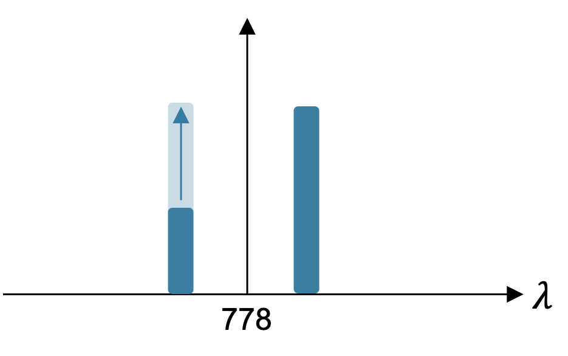

# RbONN

## Calibration

### Step 3 — grayscale transfer curve per coordinate

For every coordinate mapped in Step 2, the panel lights one `window_size`-wide
window at that coordinate (rest of the panel at `min_level`) and sweeps the
window's grayscale level across `level_range`. The measured output at each level
is that channel's **transfer curve** — how commanded grayscale maps to optical
power at its wavelength.

| Field | Meaning |
|-------|---------|
| `level_range` | SLM grayscale levels swept (ascending) |
| `intensity_levels` | normalized output power, shape `(n_coordinates, n_levels)` |
| `raw_intensity_levels` | background-subtracted output (watts / volts) |
| `min_level` / `max_level` | off / on grayscale levels carried from Step 1 |

Two acquisition backends produce the same `CalibrationResult`:

- **OSA** (`intensity_calibration`) — reduces the spectrum around each
  coordinate's calibrated wavelength, and refines the wl→px map from this
  narrower sweep.
- **DAQ bucket detector** (`intensity_calibration_daq`) — no spectral
  resolution, so intensity is a plain dark-frame subtraction: an all-`min_level`
  frame is read once as the DC background and subtracted from every window
  reading (clamped at 0). No all-bright reference is taken — the downstream
  $I_0\,\sin^2(\theta/2)$ model fits $I_0$ as a free amplitude, so absolute scale
  is irrelevant, and a full-bright panel could saturate the photodiode.

**Channels only** (DAQ): instead of walking every calibrated coordinate, scan
only where an encoding channel lands. The panel builds the same channel-map
geometry as the preview (Window px = channel width, Pad px = gap), then lights
one channel window at a time — hopping from channel centre to channel centre and
skipping the dark pads and Rb guard bands. Each row of the result is a channel,
so the sweep is roughly `n_coordinates / n_channels` times shorter (≈20× on a
typical map) while producing a `CalibrationResult` the encoder reads unchanged.
Stride is ignored in this mode.

At encode time the transfer curve is **inverted**: `EncodingChannel.level_for(val)`
maps a target normalized value $val \in [0, 1]$ to the swept grayscale level
whose measured output is closest, taken over the off→on rising segment (made
monotonic with a cumulative-max envelope so noise near the flat top can't invert
the mapping). `val = 0` → `off_level`, `val = 1` → `on_level`.

### Step 6 — TPA efficiency ($\eta$) per pair

For a channel pair with per-side commanded intensities $x, w \in [0, 1]$, the 420 intensity $Y$ can be written as:

$$Y = \eta^2 (x \cdot w) + a_x\, x + q_x\, x^2 + a_w\, w + q_w\, w^2 + d$$

| Param | Physical meaning |
|-------|------------------|
| $\eta$ | two-photon efficiency of the pair (fit is linear in $b = \eta^2$; $\eta = \sqrt{b}$) |
| $a_x,\ a_w$ | single-beam linear response of each sideband |
| $q_x,\ q_w$ | single-beam quadratic (saturation) response of each sideband |
| $d$ | dark offset (readout with both sides off) |

Single beam — one sideband on, amplitude swept (pins $a$, $q$):

Cross (pair) — one sideband pinned at $x = 1$, the other swept; the only points with $x \cdot w \neq 0$, so they pin $\eta$:

## Encoding

### Channel layout (`build_channel_layout`)

The Step-3 transfer curves feed the encoder, which tiles the panel into
symmetric channel **pairs** around the 778 nm centre:

1. Fit `wl = a·x + b` over the Step-2 map (`a < 0`: higher pixel → lower λ).
2. Anchor the centre pixel `c0 = round((778 − b) / a)`. It sits in the middle of
   a `gap_px` pad, so no channel covers it.
3. Convert the Rb guard bands (default 779.9–780.1 and 775.9–776.1 nm) to
   inclusive pixel ranges that must stay dark.
4. Tile a shared offset `m` outward from `c0` (half-pitch start,
   `pitch = width + gap`), placing a mirror pair each step: an **x**-channel at
   `c0 − m` (λ > 778) and a **w**-channel at `c0 + m` (λ < 778). One shared `m`
   keeps each pair exactly symmetric about the centre column — and, under the
   linear fit, symmetric in wavelength about 778 nm.
5. If either window would cover a guard band, `m` jumps past it (both sides move
   together, staying symmetric), so channels land on both sides of the Rb line.
   Tiling stops when either side leaves the calibrated range, so the two sides
   are always equal length (the encoder's x/w pairing contract).

Defaults: `channel_width_px = 15`, `gap_px = 5`, `n_channels = 20` per side.
Each kept channel snaps to the nearest calibration coordinate and carries that
coordinate's transfer curve. Padding, guard-band, and centre columns render at
their local off level, so they stay dark with no extra masking.
